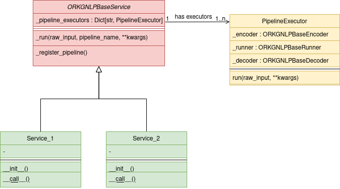

How to Contribute
=================

Internal Workflow
"""""""""""""""""
As the architecture :ref:`figure <architecture>` suggests, all our services inherit from the **ORKGNLPBaseService**
that is responsible for many common functionalities. Note that we only show the ones that should be used in an individual
service implementation. Each service has one or more **PipelineExecutors** that executes a full pipline of the common
service workflow listed below:

1. Runs the service's encoder with the user's input.
2. The encoded input is passed to the model runner, which in turn is executed.
3. The model's output is decoded to a user-friendly format using the service's decoder.

In case a service has multiple PipelineExecutors, the order of execution of the respective PipelineExecutor
is to be handled in the __call__() function of the service.

.. _architecture:

   Internal architecture of orkgnlp.

Contribution Steps
""""""""""""""""""

If you are intending to add a new service to the ``orkgnlp`` package, you should simply follow the following instructions:

1.  Create a pull request on our `repository <https://gitlab.com/TIBHannover/orkg/nlp/orkg-nlp-pypi.git>`_.
2.  Clone the source code and install the dependencies manually as described in the :doc:`installation` section.
3.  If your service depends on models or data file,

    3.1.    please create an issue linked to your pull request so that the ORKG team creates a specific ``Huggingface``
    repository for you on our `profile <https://huggingface.co/orkg>`_ and uploads your required files.
    3.2.    add your file paths and repository name to ``orkgnlp/huggingface_repos.json`` and use
    ``orkgnlp/huggingface_repos_schema.json`` to understand its structure.

4.  **Service**: Create a new module for your service under the appropriate package structure with a new class inheriting from
    ``orkgnlp.common.service.base.ORKGNLPBaseService``.

    4.1. To implement your service you only need to implement __init__() and __call__() functions. In the **__init__()**
    function you need to initiate an encoder, a runner and a decoder for your service and register a new PipelineExecutor
    in the parent class using ``self._register_pipeline()``. We explain these concepts in the following steps.
    In the **__call__()** function you need to call the ``self._run()`` function of the parent class with the right
    arguments. See the already implemented services to get more insights about the workflow.

5.  **Encoder**: If your service input is the same as the model's of the service, you can use the
    ``orkgnlp.common.service.base.ORKGNLPBaseEncoder`` as an encoder to your service. Otherwise, create a module in your
    service package named **encoder** where you implement a new Encoder class inheriting from the ORKGNLPBaseEncoder.

6.  **Runner**: Use one of our implemented runners located in ``orkgnlp.common.service.runners``.

7.  **Decoder**: If the model's output of your service is the same as the service's, you can use the
    ``orkgnlp.common.service.base.ORKGNLPBaseDecoder`` as a decoder to your service. Otherwise, create a module in your
    service package named **decoder** where you implement a new Decoder class inheriting from the ORKGNLPBaseDecoder.

8.  Finally, do not forget to :ref:`test <testing>` your service and submit your pull request for review!

Example Service
"""""""""""""""
We take the :doc:`services/bioassays_semantification` service as a simple example implementation. The service
needs a specified encoder and decoder but not a runner. You can always use predefined runners from the
``orkgnlp.common.service.runners`` package.

BioassaysSemantifier
********************

First we create the BioassaysSemantifier class that inherits from the ORKGNLPBaseService as follows:

.. code-block:: python

    class BioassaysSemantifier(ORKGNLPBaseService):

then we implement the __init__() function by creating the needed encoder, runner and decoder, and registering them
to a new PipelineExecutor in the base service:

.. code-block:: python

    def __init__(self, *args, **kwargs):
        super().__init__(config['service_name'], *args, **kwargs)

        encoder = BioassaysSemantifierEncoder(io.read_onnx(config['paths']['vectorizer']))
        runner = ORKGNLPONNXRunner(io.read_onnx(config['paths']['model']))
        decoder = BioassaysSemantifierDecoder(io.read_json(config['paths']['mapping']))

        self._register_pipeline('main', encoder, runner, decoder)

then we implement the __call__() function by calling the self._run() method with the user's input that executes the
entire pipeline we registered.

.. code-block:: python

    def __call__(self, text):
        return self._run(
            raw_input=text
        )

BioassaysSemantifierEncoder
****************************

In the encoder class we need to implement the **encode(raw_input, **kwargs)** function. The class constructor requires
a loaded vectorizer model in ``ONNX`` format which can be run using our predefined ORKGNLPONNXRunner.

.. code-block:: python

    class BioassaysSemantifierEncoder(ORKGNLPBaseEncoder):
        def __init__(self, vectorizer):
            super().__init__()
            self._vectorizer = ORKGNLPONNXRunner(vectorizer)

then we implement the encode function by converting the user's input text to a TF-IDF vector using the
initialized encoder's runner and returning a specific axis of its output as tuple of arguments. Note that the returned
value of the encoder will be used as input to the service's runner.

.. code-block:: python

    def encode(self, raw_input, **kwargs):
        preprocessed_text = self._text_process(raw_input)
        output, _ = self._vectorizer.run(
            inputs=([preprocessed_text],),
            output_names=['variable']
        )
        return (output[0][0], ), kwargs

BioassaysSemantifierDecoder
****************************
In the decoder class we need to implement the **decode(model_output, **kwargs)** function. The class constructor requires
a loaded dict object representing the mapping from cluster label to the semantified properties and resources.

.. code-block:: python

    class BioassaysSemantifierDecoder(ORKGNLPBaseDecoder):
        def __init__(self, mapping):
            super().__init__()
            self._mapping = mapping

The cluster label can be obtained from the ``model_output`` parameter of the decode function, which is obtained of running the model
internally by the PipelineExecutor, and can be used to fetch the respective properties and resources and give them back
to the service user.

.. code-block:: python

    def decode(self, model_output, **kwargs):
        cluster_label = model_output[0][0]
        return self._mapping[str(cluster_label)]['labels']

.. _testing:

Testing
"""""""
We implement our tests with the `unittests <https://docs.python.org/3/library/unittest.html>`_ package and either use it
or `pytest <https://docs.pytest.org/en/7.1.x/>`_ as test runner. For development purposes on your local machine you can
run the tests by running the following command:

.. code-block:: bash

    poetry run test -i [ignored_dir_1 ignored_dir_2 ...]
    # example:
    poetry run test -i clustering annotation

or also by simply executing `tox <https://tox.wiki/en/latest/>`_ with:

.. code-block:: bash

    tox

Tox tries to test the package on all python environments listed in the ``tox.ini`` file as soon as they are already
installed on your machine, otherwise tests for not found interpreters will be skipped.

.. note::
    Note that testing in our project is configured using ``pyproject.toml``, ``tox.ini`` and ``pytest.ini`` to divide
    responsibilities :) You might need to check all config files in case you need to change anything.

.. note::
    Also note that we ignore some tests by default in our ``tox`` configurations for the sake of GitLab CI/CD pipeline.
    We recommend running ``poetry run test`` on your local machine in order to check all tests locally.